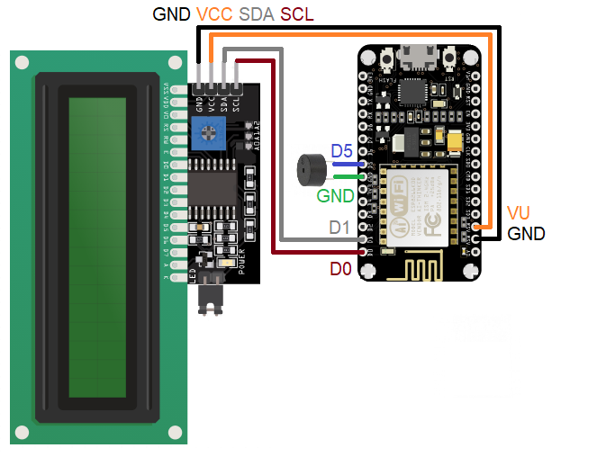

# nodemcu-remoteLCD

## General info
This is my solution to use 2x16 LCD as remote display. 
LCD connected with NodeMCU v3 IoT device receives UDP packets and shows their content on lcd. 
Device reaction for packet is choosen by first letter of packet content, as explained below.
Device can be used in various apps, as in my examples in python files.
	
## Technologies
Project is created with:
* Arduino 
* Python 3

## Connection schematic
Device should be connected as on this drawing.

## UDP syntax explaination
Device reaction is based on first character (option) of UDP packet content. 
* '0' - show text in top row
* '1' - show text in bottom row
* '2' - show long text in top row (scrolling feature)
* '3' - show long text in bottom row (scrolling feature)
* '4' - unused
* '5' - NTP clock
* '6x' - beep x times (x is between 1 and 9)
* '7' - turn backlight on
* '8' - turn backlight off
* '9' - clear display

## Examples of use
Please remember to change IP address in scripts to the one that is shown on device after establishing connection with WiFi network.
* sender.py - this script allows user to input text that will be sent as UDP packet to device, can be used for debugging and understanding way of use,
* simpleLCD.py - library that can be used to easily send text to display in other python projects,
* spotifyONLINE.py - Uses Spotipy library. It show currently played song on spotify on display,
* startNTPclock.py - can be used to quickly start NTP clock on device.
